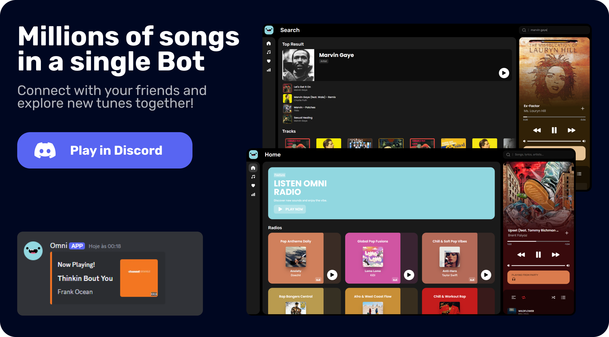

<h1 align="center">

<br>Omni Bot<br>
</h1>
<p align="center"><a href="#about">About</a> - <a href="#get-started">Get Started</a></p>



## About

Omni is a music bot for Discord that transforms the musical experience into an interactive and social journey. With features that go beyond simple song playback, Omni allows you to control your playlist directly from Discord or through the control panel, listen to public radios, create custom playlists, and share what you're currently listening to with your friends. It combines entertainment and real-time interaction, making the environment more dynamic and fun. Whether you're enjoying music alone or with friends, Omni offers everything you need for the best musical experience on Discord.

## Get Started

### Prerequisites
- NodeJS 22.14
- Phyton 3.12


### Install Packages

```sh
npm install turbo pnpm
pnpm install
```

### Development Setup

#### Server

Rename `.env.template` to `.env` in `./bot` and set the following settings:

```sh
# Get this in https://discord.com/developers/applications
DISCORD_TOKEN= # Discord Bot Token
DISCORD_ID= # Discord Bot ID
DISCORD_SECRET= # Discord Bot Secret
DISCORD_REDIRECT= # Discord Redirect URL Callback

# Get this in https://developer.spotify.com/dashboard
SPOTIFY_ID= # Spotify ID
SPOTIFY_SECRET= # Spotify Secret
```

#### Client

Rename `.env.template` to `.env` in `./bot` and set the following settings:

```sh
# Get this in https://discord.com/developers/applications
VITE_DISCORD_ID= # Discord Bot ID

VITE_API_URL=http://localhost:8080/api # Your API URL Domain
VITE_SERVER_URL=http://localhost:8443 # Your Server Url Domain
```

### Run

```
turbo dev
```
